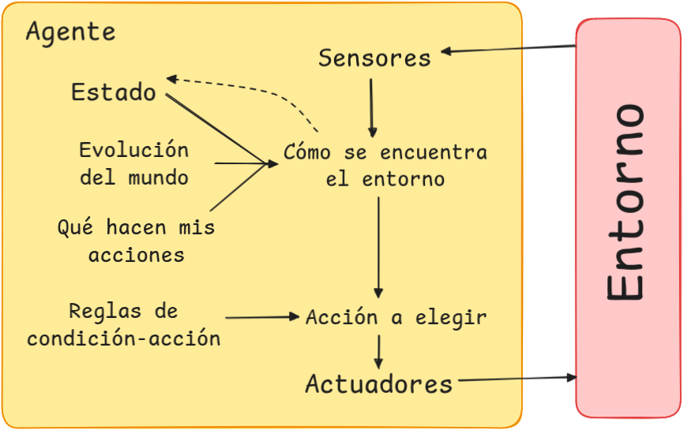

# Piedra, Papel, Tijera (RPS)

---

## Índice

1. [Especificación del entorno de tareas](#1-especificación-del-entorno-de-tareas)  
2. [Identificación del tipo de agente y estructura](#2-identificación-del-tipo-de-agente-y-estructura)  

---

## 1. Especificación del entorno de tareas

Primero, se analizarán las propiedades del entorno para poder escoger el agente adecuado. En la siguiente tabla se resumen las características del entorno:

| **Propiedad**         | **Descripción breve**                                                                                    |
|-----------------------|---------------------------------------------------------------------------------------------------------|
| **Observable**        | **Completamente observable**: El agente conoce toda la información relevante del entorno en cada ronda. |
| **Agentes**           | **Multi-agente**: El juego involucra dos jugadores (máquina y humano, o dos máquinas)                   |
| **Adversarial**       | **Adversarial**: El éxito de un jugador depende directamente del fallo del otro                         |
| **Determinista**      | **Determinista**: Las acciones de ambos jugadores determinan el resultado de la ronda sin incerteza.    |
| **Secuencial**        | **Secuencial**: El agente depende del historial acumulado, el que conecta las decisiones entre rondas.  |
| **Estático**          | **Estático**: El estado del entorno no cambia mientras el agente no toma decisiones.                    |
| **Discreto**          | **Discreto**: Las acciones y estados posibles son finitos y bien definidos (piedra, papel, tijera)      |
| **Conocido**          | **Conocido**: Las reglas y resultados del juego son completamente comprensibles y especificados.        |

### Justificación de las propiedades 

1. **Observable**: El entorno es totalmente observable porque el agente tiene acceso a toda la información relevante en cada momento, como la última acción del oponente y las reglas del juego. La incertidumbre sobre la próxima acción no implica falta de información observable, sino la naturaleza competitiva del juego.

2. **Agentes**: El juego es claramente un entorno multi-agente, ya que las decisiones de cada jugador afectan directamente al resultado final. La interacción es competitiva, dado que el éxito de un jugador implica el fallo de otro.

3. **Adversarial**: El juego es adversarial porque los objetivos de los dos agentes están en conflicto: el éxito de uno es el fallo del otro. Esto hace que el agente deba analizar estrategias que maximizan su probabilidad de éxito.

4. **Determinista**: El juego es determinista, dado que la combinación de acciones (piedra, papel, tijera) tiene un resultado fijo predefinido. No hay elementos de aleatoriedad inherente en las reglas del juego.

5. **Secuencial**: El entorno es secuencial porque las decisiones del agente están influídas por el historial acumulado de las rondas previas. El modelo interno emplea estas observaciones para predecir futuras acciones del oponente y mejorar el rendimiento del agente.

6. **Estático**: El entorno es estático porque no cambia mientras el agente toma su decisión. No hay eventos externos ni variaciones en el estado de juego durante la deliberación.

7. **Discreto**: El juego es discreto, ya que las acciones posibles son finitas (piedra, papel, tijera) y están perfectamente definidas. No hay estados continuos ni transiciones indefinidas.

8. **Conocido**: El entorno es conocido, ya que las reglas del juego están completamente especificadas y el agente no necesita aprender las interacciones entre acciones.

---

## 2. Identificación del tipo de agente y estructura

### Tipo de agente seleccionado

En este caso, el tipo de agente adecuado para el juego **Piedra, Papel, Tijera** es un **agente reflexivo basado en modelos**. Este agente utiliza un modelo interno para crear un historial de acciones del usuario y así poder predecir sus movimientos futuros. La elección de este tipo de agente permite tomar decisiones informadas para tratar de mejorar su desempeño en el juego.

### Modelo de la estructura del agente

A continuación se presenta un diagrama que ilustra la estructura del agente basado en modelos para el juego:

### Explicación de los componentes del agente

1. **Estado:** En esta parte se almacena el historial de acciones del usuario y del agente. Este es esencial para que el agente pueda analizar patrones y realizar predicciones basadas en datos históricos.

2. **Evolución del mundo:** Este otro componente actualiza el estado del agente utilizando las acciones previas del usuario. Permite que el agente adapte su modelo interno en tiempo real.

3. **Qué hacen mis acciones:** Este módulo calcula la acción óptima a tomar en base al historial y las reglas del juego. Por ejemplo, si el usuario tiende a repetir el uso de Piedra, este componente contrarrestará la acción de manera efectiva.

4. **Reglas de condición-acción:** Define las reglas del juego (victoria, derrota, empate) para guiar al agente en la selección de la acción adecuada.

5. **Sensores:** Captan la entrada del usuario (su acción actual) y el estado del entorno.

6. **Actuadores:** Llevan a cabo la acción elegida por el agente y la devuelven al entorno.

Este modelo asegura que el agente pueda aprender y adaptarse a las estrategias del adversario, mejorando su capacidad para competir de manera efectiva.
