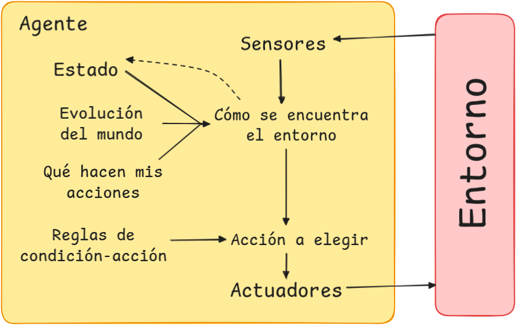

# Piedra, Papel, Tijera (RPS)

En repositorio se recoge un proyecto compuesto por una implementación ampliada del juego Piedra, Papel, Tijera, incluyendo las variantes Lagarto y Spock. Está desarrollado en Python, empleando un agente reflexivo basado en modelos que analiza el historial de jugadas para tratar de anticiparse al usuario. La estructura del código es modular, complementada con tests automatizados para garantizar su funcionalidad mediante el empleo de pytest.


---

## Índice

1. [Especificación del entorno de tareas](#1-especificación-del-entorno-de-tareas)
2. [Identificación del tipo de agente y estructura](#2-identificación-del-tipo-de-agente-y-estructura)
3. [Instalación y uso del repositorio](#3-instalación-y-uso-del-repositorio)

---

## 1. Especificación del entorno de tareas

Primero, se analizarán las propiedades del entorno para poder escoger el agente adecuado. En la siguiente tabla se resumen las características del entorno:

| **Propiedad**         | **Descripción breve**                                                                                     |
|-----------------------|-----------------------------------------------------------------------------------------------------------|
| **Observable**        | **Parcialmente observable**: El agente no conoce toda la información relevante del entorno en cada ronda. |
| **Agentes**           | **Multi-agente**: El juego involucra dos jugadores (máquina y usuario).                                   |
| **Adversarial**       | **Adversarial**: El éxito de un jugador depende directamente del fallo del otro.                          |
| **Determinista**      | **No determinista**: Las acciones de los jugadores pueden generar resultados inciertos.                   |
| **Secuencial**        | **Secuencial**: El agente depende del historial acumulado; el que conecta las decisiones entre rondas.    |
| **Estático**          | **Estático**: El estado del entorno no cambia mientras el agente no tome decisiones.                      |
| **Discreto**          | **Discreto**: Las acciones y estados posibles son finitos y definidos (piedra, papel, tijera).            |
| **Conocido**          | **Conocido**: Las reglas y resultados del juego son comprensibles y especificados.                        |


### Justificación de las propiedades 

1. **Observable**: El entorno es parcialmente observable porque el agente carece de acceso a toda la información relevante en cada momento, como la próxima acción del oponente, pese a que cada agente si que conoce las reglas del juego y todas las posibilidades.

2. **Agentes**: El juego es claramente un entorno multi-agente, ya que las decisiones de cada jugador afectan directamente al resultado final. La interacción entre ambos es competitiva puesto que el éxito de un jugador implica el fallo de otro.

3. **Adversarial**: El entorno es adversarial porque los objetivos de los dos agentes están en conflicto: el éxito de uno es el fallo del otro.

4. **Determinista**: El entorno es no determinista pues, aunque las reglas del juego son claras, las acciones de los jugadores generan cierta incertidumbre. Por ejemplo, la acción del oponente no puede ser predecida con certeza, introduciendo variabilidad en el resultado.

5. **Secuencial**: El entorno es secuencial porque las decisiones del agente están influídas por el historial acumulado de las rondas previas. El modelo interno emplea estas observaciones para predecir futuras acciones del oponente y mejorar el rendimiento del agente.

6. **Estático**: El entorno es estático porque no cambia mientras el agente toma su decisión. No hay eventos externos ni variaciones en el estado de juego durante la deliberación.

7. **Discreto**: El juego es discreto, ya que las acciones posibles son finitas (piedra, papel, tijera) y están perfectamente definidas. No hay estados continuos ni transiciones indefinidas.

8. **Conocido**: El entorno es conocido, ya que las reglas del juego están completamente especificadas y el agente no necesita aprender las interacciones entre acciones.

---

## 2. Identificación del tipo de agente y estructura

### Tipo de agente seleccionado

En este caso, el tipo de agente adecuado para el juego **Piedra, Papel, Tijera** es un **agente reflexivo basado en modelos**. Este agente utiliza un modelo interno para crear un historial de acciones del usuario y así poder predecir sus movimientos futuros. La elección de este tipo de agente permite tomar decisiones informadas para tratar de mejorar su desempeño en el juego.


### Modelo de la estructura del agente

A continuación se presenta un diagrama que ilustra la estructura del agente basado en modelos para el juego:




### Explicación de los componentes del agente

1. **Estado:** En esta parte se almacena el historial de acciones del usuario y del agente. Este es esencial para que el agente pueda analizar patrones y realizar predicciones basadas en datos históricos. || **En el código:** El historial de acciones del usuario se almacena en user_history.

2. **Evolución del mundo:** Este otro componente actualiza el estado del agente utilizando las acciones previas del usuario. Permite que el agente adapte su modelo interno en tiempo real. || **En el código:** La función update_user_history() actualiza el historial del usuario, asegurando que solo se conserven las últimas 20 acciones.

3. **Qué hacen mis acciones:** Este módulo calcula la acción óptima a tomar en base al historial y las reglas del juego. Por ejemplo, si el usuario tiende a repetir el uso de Piedra, este componente contrarrestará la acción de manera efectiva. || **En el código:** La función get_computer_action() calcula la acción óptima del agente basándose en el historial del usuario y las reglas del juego.

4. **Reglas de condición-acción:** Define las reglas del juego (victoria, derrota, empate) para guiar al agente en la selección de la acción adecuada. || **En el código:** Aunque no están directamente en agent.py, las reglas se aplican dentro de get_computer_action() para contrarrestar las acciones del usuario.

5. **Sensores:** Captan la entrada del usuario (su acción actual) y el estado del entorno. || **En el código:** Las entradas del usuario se captan en user_interface.py y se utilizan en update_user_history().

6. **Actuadores:** Llevan a cabo la acción elegida por el agente y la devuelven al entorno. || **En el código:** La decisión calculada por get_computer_action() representa la acción del agente en el entorno.

Este modelo asegura que el agente pueda aprender y adaptarse a las estrategias del adversario, mejorando su capacidad para competir de manera efectiva.

---

## 3. Instalación y uso del repositorio

### Pasos para la instalación:

1. **Clonar el repositorio**:

   ```sh
   git clone https://github.com/Bl4nc018/Proyecto-RPS-IABD.git
   cd Proyecto-RPS-IABD
   ```
   
2. **Crear y activar un entorno virtual (opcional, recomendado)**:

   ```sh
   python3 -m venv venv
   source venv/bin/activate  # En Windows: venv\Scripts\activate
   ```
  
    - **Una vez en el entorno, instalar las dependencias necesarias. (Procurar tener pip actualizado e instalar los requerimientos):**
  
      ```sh
      pip install --upgrade pip
      pip install -r requirements.txt
      ```

3. **Ejecutar el juego. Para iniciarlo, deberás ejecutar lo siguiente en el archivo principal:**
 
    ```sh
    python src/main.py
    ```
    
4. **Ejecutar los test (opcional) Si deseas verificar que todo funciona, utiliza pytest:**

    ```sh
    pytest
    ```

---

### Desarrollado por:

<p align="left">
   <a href="https://github.com/Bl4nc018">
      <br>
      <sub>Ania</sub>
   </a>
</p>
